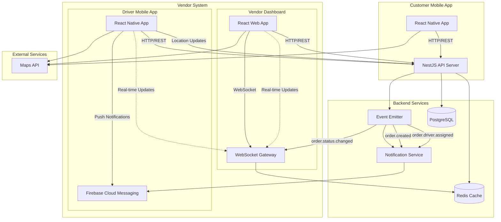
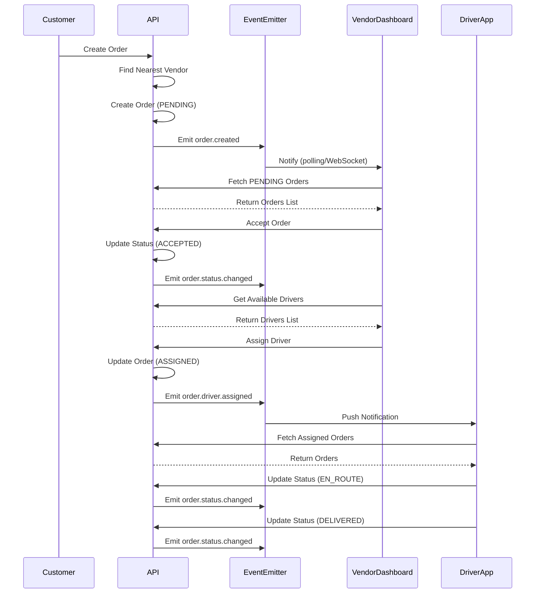
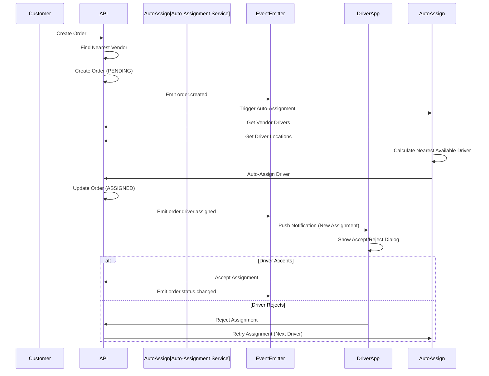

# Vendor & Driver Management System - Implementation Plan

## Overview

This document outlines the hybrid approach for vendor order management and driver assignment, from MVP (Phase 1) through full automation (Phase 2).

## Current State

- ✅ Order creation with automatic vendor selection (nearest vendor by distance)
- ✅ Order status state machine (PENDING → ACCEPTED → ASSIGNED → EN_ROUTE → DELIVERED → COMPLETED)
- ✅ EventEmitter2 for event-driven architecture
- ✅ Driver model with location tracking fields (`currentLatitude`, `currentLongitude`)
- ✅ Manual driver assignment endpoint exists
- ❌ No vendor dashboard
- ❌ No driver mobile app
- ❌ No real-time notifications
- ❌ No automatic driver assignment

---

## Phase 1: MVP - Vendor Dashboard & Basic Driver App

### Phase 1 Features

#### Vendor Dashboard (Web Application)
- **Authentication**
  - Vendor login (phone + OTP, same as customer app)
  - Session management
  - Role-based access (VENDOR role)

- **Order Management**
  - View incoming orders (PENDING status)
    - Filter by status, date, location
    - Sort by distance, time, priority
  - Accept/Reject orders
    - One-click accept/reject
    - Bulk actions (accept multiple)
  - View order details
    - Customer info, delivery address, quantity, payment method
    - Map view of delivery location
    - Order history/timeline
  - Assign drivers to orders
    - List of available drivers for vendor
    - Manual selection and assignment
    - View driver location (if available)
  - View active orders
    - Orders in ACCEPTED, ASSIGNED, EN_ROUTE status
    - Real-time status updates (polling or WebSocket)
  - Order history
    - Completed, cancelled, rejected orders
    - Filter and search capabilities

- **Driver Management**
  - View all drivers for vendor
  - See driver availability status
  - View driver current location (if tracked)
  - View driver stats (total deliveries, rating)

- **Dashboard Analytics** (Basic)
  - Today's orders count
  - Pending orders count
  - Active deliveries count
  - Revenue summary (if payment tracking added)

#### Driver Mobile App (React Native)
- **Authentication**
  - Driver login (phone + OTP)
  - Session management
  - Role-based access (DRIVER role)

- **Order Management**
  - View assigned orders
    - List of orders assigned to driver
    - Filter by status
  - View order details
    - Customer info, delivery address
    - Map view with navigation
    - Order quantity, payment method
  - Update order status
    - Mark as EN_ROUTE (start delivery)
    - Mark as DELIVERED (complete delivery)
    - Add delivery notes
  - View order history
    - Completed deliveries
    - Earnings summary (if payment tracking added)

- **Location Tracking** (Basic)
  - Manual location update
  - Update availability status (available/unavailable)

- **Notifications** (Basic)
  - Push notifications for new assignments
  - Order status change notifications

---

## Phase 2: Scale - Smart Auto-Assignment & Enhanced Features

### Phase 2 Features

#### Enhanced Vendor Dashboard
- **Smart Auto-Assignment**
  - Automatic driver assignment based on:
    - Delivery location proximity
    - Driver current location
    - Driver availability
    - Driver workload (active orders count)
  - Vendor can override auto-assignments
  - Assignment rules configuration
    - Max distance for assignment
    - Max orders per driver
    - Priority zones

- **Service Area Management**
  - Define service areas/zones for vendor
  - Visual map editor for service boundaries
  - Auto-filter orders by service area
  - Service area analytics

- **Advanced Analytics**
  - Order trends (daily, weekly, monthly)
  - Driver performance metrics
  - Delivery time analytics
  - Revenue reports
  - Customer satisfaction metrics

- **Real-time Updates**
  - WebSocket connection for live order updates
  - Live driver location tracking
  - Real-time order status changes

#### Enhanced Driver App
- **Smart Notifications**
  - Push notifications for new order assignments
  - Accept/reject order requests
  - Time-sensitive notifications (order timeout)
  - Navigation integration

- **Automatic Location Tracking**
  - Background location updates
  - Real-time location sharing
  - Location history
  - Geofencing for delivery zones

- **Enhanced Order Management**
  - Accept/reject new assignments
  - Batch order viewing (multiple deliveries)
  - Route optimization suggestions
  - Delivery time estimates
  - Customer contact (call/SMS)

- **Performance Tracking**
  - Delivery statistics
  - Earnings tracking
  - Rating display
  - Performance goals

---

## Architecture

### System Architecture Diagram



### Data Flow: Order Assignment (Phase 1)



### Data Flow: Smart Auto-Assignment (Phase 2)



---

## Step-by-Step Implementation Plan

### Phase 1: MVP Implementation

#### Step 1: Backend - Notification System Foundation
**Files to Create/Modify:**
- `backend/prisma/schema.prisma` - Add Notification model
- `backend/src/notifications/notifications.service.ts` - Implement notification CRUD
- `backend/src/notifications/notifications.module.ts` - Update module
- `backend/src/notifications/listeners/order-notification.listener.ts` - Event listeners

**Tasks:**
1. Add Notification model to Prisma schema:
   - `id`, `userId`, `type`, `title`, `message`, `data` (JSON), `read`, `createdAt`
   - Indexes on `userId`, `read`, `createdAt`
2. Create migration and generate Prisma client
3. Implement NotificationsService with CRUD operations
4. Create event listeners for order events:
   - `order.created` → Create notification for vendor
   - `order.driver.assigned` → Create notification for driver
   - `order.status.changed` → Create notifications for relevant parties
5. Add notification endpoints:
   - `GET /notifications` - Get user notifications
   - `PATCH /notifications/:id/read` - Mark as read
   - `GET /notifications/unread-count` - Get unread count

**Dependencies:** None (uses existing EventEmitter)

---

#### Step 2: Backend - Vendor Order Endpoints
**Files to Create/Modify:**
- `backend/src/orders/orders.controller.ts` - Add vendor-specific endpoints
- `backend/src/orders/orders.service.ts` - Add vendor order methods

**Tasks:**
1. Add vendor order endpoints:
   - `GET /orders/vendor/pending` - Get pending orders for vendor
   - `GET /orders/vendor/active` - Get active orders (ACCEPTED, ASSIGNED, EN_ROUTE)
   - `PATCH /orders/:id/accept` - Vendor accepts order
   - `PATCH /orders/:id/reject` - Vendor rejects order
   - `GET /orders/vendor/history` - Get order history
2. Add authorization checks (vendor can only see their orders)
3. Add filtering and pagination
4. Include order details (customer, address, driver if assigned)

**Dependencies:** Step 1 (for notifications)

---

#### Step 3: Backend - Driver Order Endpoints
**Files to Create/Modify:**
- `backend/src/orders/orders.controller.ts` - Add driver-specific endpoints
- `backend/src/orders/orders.service.ts` - Add driver order methods

**Tasks:**
1. Add driver order endpoints:
   - `GET /orders/driver/assigned` - Get assigned orders for driver
   - `GET /orders/driver/active` - Get active orders (ASSIGNED, EN_ROUTE)
   - `PATCH /orders/:id/start-delivery` - Mark as EN_ROUTE
   - `PATCH /orders/:id/complete-delivery` - Mark as DELIVERED
   - `GET /orders/driver/history` - Get delivery history
2. Add authorization checks (driver can only see their orders)
3. Add location update endpoint:
   - `PATCH /drivers/me/location` - Update driver location
   - `PATCH /drivers/me/availability` - Update availability status

**Dependencies:** Step 1 (for notifications)

---

#### Step 4: Backend - WebSocket Gateway (Optional for Phase 1)
**Files to Create:**
- `backend/src/websocket/websocket.gateway.ts` - WebSocket gateway
- `backend/src/websocket/websocket.module.ts` - WebSocket module

**Tasks:**
1. Install `@nestjs/websockets` and `socket.io` (or native WebSockets)
2. Create WebSocket gateway for real-time updates
3. Emit events for:
   - New orders (to vendor)
   - Order status changes (to vendor, driver, customer)
   - Driver location updates (to vendor)
4. Add authentication to WebSocket connections
5. Room-based messaging (vendor rooms, driver rooms)

**Dependencies:** None (can use polling as fallback)

**Note:** This is optional for Phase 1. Can use polling instead and add WebSocket in Phase 2.

---

#### Step 5: Vendor Dashboard - Project Setup
**Files to Create:**
- `vendor-dashboard/` - New directory for vendor web app
- `vendor-dashboard/package.json` - React/Next.js setup
- `vendor-dashboard/src/` - Source directory structure

**Tasks:**
1. Initialize Next.js or React + Vite project
2. Set up TypeScript configuration
3. Install dependencies:
   - `axios` for API calls
   - `react-query` or `swr` for data fetching
   - `zustand` or `redux` for state management
   - `react-router-dom` or Next.js routing
   - UI library (shadcn/ui, Material-UI, or Tailwind UI)
   - Maps library (Google Maps, Mapbox, or Leaflet)
4. Set up API service layer
5. Set up authentication context
6. Configure environment variables

**Dependencies:** None

---

#### Step 6: Vendor Dashboard - Authentication
**Files to Create:**
- `vendor-dashboard/src/services/authService.ts`
- `vendor-dashboard/src/context/AuthContext.tsx`
- `vendor-dashboard/src/pages/Login.tsx` (or components)

**Tasks:**
1. Implement OTP-based authentication (same as customer app)
2. Create auth service with API calls
3. Create auth context for state management
4. Build login screen
5. Add protected route wrapper
6. Handle token refresh

**Dependencies:** Step 5

---

#### Step 7: Vendor Dashboard - Order Management
**Files to Create:**
- `vendor-dashboard/src/pages/Orders.tsx` - Orders list page
- `vendor-dashboard/src/pages/OrderDetail.tsx` - Order details page
- `vendor-dashboard/src/components/OrderCard.tsx` - Order card component
- `vendor-dashboard/src/components/OrderFilters.tsx` - Filter component
- `vendor-dashboard/src/services/orderService.ts` - Order API service

**Tasks:**
1. Build orders list page with:
   - Tabs for PENDING, ACTIVE, HISTORY
   - Order cards with key info
   - Filter and sort functionality
   - Pagination
2. Build order detail page with:
   - Full order information
   - Customer details
   - Delivery address with map
   - Order timeline/history
   - Accept/Reject buttons (for PENDING)
   - Assign driver section (for ACCEPTED)
3. Implement order actions:
   - Accept order
   - Reject order
   - Assign driver
4. Add real-time updates (polling or WebSocket)

**Dependencies:** Step 2, Step 6

---

#### Step 8: Vendor Dashboard - Driver Management
**Files to Create:**
- `vendor-dashboard/src/pages/Drivers.tsx` - Drivers list page
- `vendor-dashboard/src/components/DriverCard.tsx` - Driver card component
- `vendor-dashboard/src/services/driverService.ts` - Driver API service

**Tasks:**
1. Build drivers list page showing:
   - All drivers for vendor
   - Availability status
   - Current location (if available)
   - Active orders count
   - Stats (total deliveries, rating)
2. Add driver selection modal for order assignment
3. Show driver location on map (if tracked)

**Dependencies:** Step 6

---

#### Step 9: Driver App - Project Setup
**Files to Create:**
- `driver-app/` - New directory (or extend existing mobile app)
- `driver-app/src/` - Source directory structure

**Tasks:**
1. Option A: Create separate React Native app
   - Initialize Expo project
   - Set up navigation
   - Configure API service
2. Option B: Extend existing mobile app
   - Add driver-specific screens to `mobile/src/screens/driver/`
   - Add driver navigation stack
   - Add role-based routing
3. Install dependencies:
   - `expo-location` for location tracking
   - `expo-notifications` for push notifications
   - Maps library (`react-native-maps`)
4. Set up authentication (same as customer app)

**Dependencies:** None

**Recommendation:** Option B (extend existing app) for code reuse and easier maintenance.

---

#### Step 10: Driver App - Authentication & Navigation
**Files to Create/Modify:**
- `mobile/src/screens/driver/LoginScreen.tsx` (if separate)
- `mobile/src/navigation/DriverNavigator.tsx` - Driver navigation stack
- `mobile/src/context/AuthContext.tsx` - Update to handle DRIVER role

**Tasks:**
1. Implement driver authentication (OTP-based, same flow)
2. Create driver navigation stack:
   - Home (Assigned Orders)
   - Active Orders
   - Order History
   - Profile
3. Add role-based routing in AppNavigator
4. Update AuthContext to handle driver role

**Dependencies:** Step 9

---

#### Step 11: Driver App - Order Management
**Files to Create:**
- `mobile/src/screens/driver/AssignedOrdersScreen.tsx` - Assigned orders list
- `mobile/src/screens/driver/OrderDetailScreen.tsx` - Order details
- `mobile/src/screens/driver/ActiveOrdersScreen.tsx` - Active orders
- `mobile/src/services/driverOrderService.ts` - Driver order API service

**Tasks:**
1. Build assigned orders screen:
   - List of orders assigned to driver
   - Order status badges
   - Quick actions (Start Delivery, Complete)
2. Build order detail screen:
   - Full order information
   - Customer contact info
   - Delivery address with map
   - Navigation integration
   - Status update buttons
3. Implement order actions:
   - Mark as EN_ROUTE
   - Mark as DELIVERED
   - Add delivery notes
4. Add order history screen

**Dependencies:** Step 3, Step 10

---

#### Step 12: Driver App - Location Tracking (Basic)
**Files to Create:**
- `mobile/src/services/locationService.ts` - Location service
- `mobile/src/screens/driver/ProfileScreen.tsx` - Update with location controls

**Tasks:**
1. Implement manual location update:
   - Button to update current location
   - Send location to backend
2. Add availability toggle:
   - Available/Unavailable switch
   - Update driver status
3. Basic location permission handling

**Dependencies:** Step 3, Step 11

---

#### Step 13: Push Notifications Setup
**Files to Create/Modify:**
- `backend/src/notifications/services/push-notification.service.ts` - Push notification service
- `mobile/src/services/notificationService.ts` - Mobile notification handler
- `mobile/app.json` - Update with notification config

**Tasks:**
1. Set up Firebase Cloud Messaging (FCM):
   - Create Firebase project
   - Configure Android/iOS apps
   - Get FCM server key
2. Install `firebase-admin` in backend
3. Create push notification service:
   - Send notifications to devices
   - Store device tokens
   - Handle token refresh
4. Update mobile app:
   - Request notification permissions
   - Register for push notifications
   - Handle notification events
   - Store device token on backend
5. Integrate with order events:
   - Send notification on driver assignment
   - Send notification on order status changes

**Dependencies:** Step 1, Step 11

---

### Phase 2: Scale Implementation

#### Step 14: Backend - Auto-Assignment Service
**Files to Create:**
- `backend/src/orders/services/auto-assignment.service.ts` - Auto-assignment logic
- `backend/src/orders/orders.service.ts` - Integrate auto-assignment

**Tasks:**
1. Create auto-assignment algorithm:
   - Find nearest available driver to delivery location
   - Consider driver current location
   - Check driver availability
   - Check driver workload (max orders)
   - Calculate distance using PostGIS
2. Add auto-assignment trigger:
   - Option 1: On order acceptance (vendor accepts → auto-assign)
   - Option 2: On order creation (auto-assign immediately)
3. Add assignment rules configuration:
   - Max distance for assignment
   - Max orders per driver
   - Priority zones/areas
4. Add fallback logic:
   - If no driver available, keep order in ACCEPTED status
   - Vendor can manually assign later
5. Add override capability:
   - Vendor can reassign after auto-assignment
   - Log assignment method (auto vs manual)

**Dependencies:** Phase 1 complete

---

#### Step 15: Backend - Service Area Management
**Files to Create/Modify:**
- `backend/prisma/schema.prisma` - Add ServiceArea model
- `backend/src/vendors/services/service-area.service.ts` - Service area logic
- `backend/src/vendors/vendors.service.ts` - Integrate service areas

**Tasks:**
1. Add ServiceArea model to schema:
   - `id`, `vendorId`, `name`, `boundaries` (PostGIS polygon), `isActive`
2. Create migration
3. Implement service area service:
   - Create/update/delete service areas
   - Check if point is within service area
   - Find vendors by service area
4. Update vendor selection logic:
   - Filter vendors by service area first
   - Then find nearest within service area
5. Add service area endpoints:
   - `GET /vendors/:id/service-areas` - Get vendor service areas
   - `POST /vendors/:id/service-areas` - Create service area
   - `DELETE /vendors/:id/service-areas/:areaId` - Delete service area

**Dependencies:** Phase 1 complete

---

#### Step 16: Backend - Enhanced Location Tracking
**Files to Create/Modify:**
- `backend/src/drivers/services/location-tracking.service.ts` - Location tracking service
- `backend/src/drivers/drivers.service.ts` - Add location update methods

**Tasks:**
1. Create location tracking service:
   - Store location history
   - Calculate distance traveled
   - Detect geofence events
2. Add background location update endpoint:
   - Accept frequent location updates
   - Batch updates for efficiency
   - Store in Redis for real-time access
3. Add location history endpoint:
   - Get driver location over time
   - For analytics and route optimization
4. Add geofencing:
   - Detect when driver enters/leaves delivery zone
   - Trigger notifications

**Dependencies:** Step 12 (Phase 1)

---

#### Step 17: Vendor Dashboard - Auto-Assignment UI
**Files to Create/Modify:**
- `vendor-dashboard/src/components/AutoAssignmentSettings.tsx` - Settings component
- `vendor-dashboard/src/pages/Settings.tsx` - Settings page

**Tasks:**
1. Add auto-assignment settings:
   - Enable/disable auto-assignment
   - Configure max distance
   - Configure max orders per driver
   - Set priority zones
2. Show assignment method in order list (auto vs manual)
3. Add override UI:
   - Reassign button for auto-assigned orders
   - Show assignment reason/logic

**Dependencies:** Step 14

---

#### Step 18: Vendor Dashboard - Service Area Management
**Files to Create:**
- `vendor-dashboard/src/pages/ServiceAreas.tsx` - Service areas page
- `vendor-dashboard/src/components/ServiceAreaMap.tsx` - Map editor component

**Tasks:**
1. Build service area management page:
   - List of service areas
   - Create/edit/delete areas
2. Build map editor:
   - Draw polygons on map
   - Edit boundaries
   - Visualize service coverage
3. Add service area analytics:
   - Orders per area
   - Coverage visualization

**Dependencies:** Step 15

---

#### Step 19: Driver App - Enhanced Location Tracking
**Files to Create/Modify:**
- `mobile/src/services/backgroundLocationService.ts` - Background location service
- `mobile/src/screens/driver/ProfileScreen.tsx` - Update with background tracking toggle

**Tasks:**
1. Implement background location tracking:
   - Use `expo-location` background tasks
   - Update location every X minutes
   - Send to backend
2. Add location tracking toggle:
   - Enable/disable background tracking
   - Show tracking status
3. Add battery optimization handling
4. Add location accuracy settings

**Dependencies:** Step 16

---

#### Step 20: Driver App - Accept/Reject Orders
**Files to Create/Modify:**
- `mobile/src/screens/driver/AssignedOrdersScreen.tsx` - Add accept/reject UI
- `mobile/src/services/driverOrderService.ts` - Add accept/reject methods

**Tasks:**
1. Add accept/reject flow:
   - Show notification when order assigned
   - Accept/reject dialog
   - Timeout handling (auto-reject if not accepted)
2. Update order list to show pending acceptances
3. Add assignment notifications with actions

**Dependencies:** Step 14, Step 13

---

#### Step 21: Analytics & Reporting
**Files to Create:**
- `backend/src/analytics/analytics.service.ts` - Analytics service
- `vendor-dashboard/src/pages/Analytics.tsx` - Analytics dashboard

**Tasks:**
1. Create analytics service:
   - Order trends (daily, weekly, monthly)
   - Driver performance metrics
   - Delivery time analytics
   - Revenue reports
2. Build analytics dashboard:
   - Charts and graphs
   - Export functionality
   - Date range filters
3. Add driver performance page:
   - Individual driver stats
   - Comparison views

**Dependencies:** Phase 1 complete

---

## Database Schema Changes

### Phase 1

```prisma
model Notification {
  id        String   @id @default(uuid())
  userId    String
  type      String   // ORDER_ASSIGNED, ORDER_STATUS_CHANGED, etc.
  title     String
  message   String
  data      Json?    // Additional data (orderId, etc.)
  read      Boolean  @default(false)
  createdAt DateTime @default(now())
  
  @@index([userId])
  @@index([read])
  @@index([createdAt])
  @@map("notifications")
}
```

### Phase 2

```prisma
model ServiceArea {
  id        String   @id @default(uuid())
  vendorId  String
  name      String
  boundaries Geometry @db.Polygon  // PostGIS polygon
  isActive  Boolean  @default(true)
  createdAt DateTime @default(now())
  
  vendor    Vendor   @relation(fields: [vendorId], references: [id])
  
  @@index([vendorId])
  @@map("service_areas")
}

// Update Vendor model
model Vendor {
  // ... existing fields
  serviceAreas ServiceArea[]
}
```

---

## API Endpoints Summary

### Phase 1 Endpoints

#### Vendor Endpoints
- `GET /orders/vendor/pending` - Get pending orders
- `GET /orders/vendor/active` - Get active orders
- `GET /orders/vendor/history` - Get order history
- `PATCH /orders/:id/accept` - Accept order
- `PATCH /orders/:id/reject` - Reject order
- `GET /vendors/me/drivers` - Get vendor's drivers
- `GET /notifications` - Get notifications
- `PATCH /notifications/:id/read` - Mark as read

#### Driver Endpoints
- `GET /orders/driver/assigned` - Get assigned orders
- `GET /orders/driver/active` - Get active orders
- `GET /orders/driver/history` - Get delivery history
- `PATCH /orders/:id/start-delivery` - Mark as EN_ROUTE
- `PATCH /orders/:id/complete-delivery` - Mark as DELIVERED
- `PATCH /drivers/me/location` - Update location
- `PATCH /drivers/me/availability` - Update availability
- `POST /drivers/me/device-token` - Register for push notifications

### Phase 2 Endpoints

#### Auto-Assignment
- `POST /orders/:id/auto-assign` - Trigger auto-assignment
- `GET /orders/:id/assignment-suggestions` - Get assignment suggestions

#### Service Areas
- `GET /vendors/:id/service-areas` - Get service areas
- `POST /vendors/:id/service-areas` - Create service area
- `PUT /vendors/:id/service-areas/:areaId` - Update service area
- `DELETE /vendors/:id/service-areas/:areaId` - Delete service area

#### Analytics
- `GET /analytics/vendor/orders` - Order analytics
- `GET /analytics/vendor/drivers` - Driver performance
- `GET /analytics/vendor/revenue` - Revenue reports

---

## Implementation Timeline Estimate

### Phase 1 (MVP): 4–6 weeks
- Week 1: Backend foundation (Steps 1–4)
- Week 2: Vendor dashboard core (Steps 5–7)
- Week 3: Driver app core (Steps 9–11)
- Week 4: Location & notifications (Steps 12–13)
- Week 5–6: Testing, polish, bug fixes

### Phase 2 (Scale): 3–4 weeks
- Week 1: Auto-assignment & service areas (Steps 14–16)
- Week 2: Enhanced UI features (Steps 17–18)
- Week 3: Driver enhancements (Steps 19–20)
- Week 4: Analytics & final polish (Step 21)

---

## Success Metrics

### Phase 1
- Vendor can accept/reject orders within 2 minutes
- Driver can view and update order status
- Manual assignment time < 30 seconds
- Notification delivery rate > 95%

### Phase 2
- Auto-assignment success rate > 80%
- Average assignment time < 10 seconds
- Driver acceptance rate > 90%
- Delivery time improvement > 15%

---

## Risk Mitigation

### Phase 1 Risks
- **Risk:** WebSocket complexity  
  - **Mitigation:** Start with polling, add WebSocket later

- **Risk:** Push notification setup complexity  
  - **Mitigation:** Use Expo's built-in notification system first

- **Risk:** Location tracking battery drain  
  - **Mitigation:** Manual updates in Phase 1, optimize in Phase 2

### Phase 2 Risks
- **Risk:** Auto-assignment algorithm accuracy  
  - **Mitigation:** Start with simple distance-based, iterate based on data

- **Risk:** Service area polygon complexity  
  - **Mitigation:** Start with simple radius, add polygons later

---

## Next Steps

1. Review and approve this plan
2. Prioritize Phase 1 features (can some be deferred?)
3. Decide on vendor dashboard framework (Next.js vs React + Vite)
4. Decide on driver app approach (separate vs extend existing)
5. Set up Firebase project for push notifications
6. Begin Step 1: Notification system foundation

